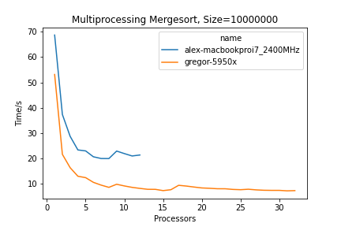

# Multiprocessing Mergesort

This project implements a multiprocessing mergesort algorithm. It then analyzes the algorithm using 
factors like input size, number of processors, speedup, and efficiency.

Packages used: Numpy, Pandas, Seaborn, Matplot

## Source Code

The source code is located in GitHub at the following location:

* <https://github.com/cloudmesh/cloudmesh-mpi/tree/main/examples/sort>

We distinguish the following important files:

* [sandra.ipynb](https://github.com/cloudmesh/cloudmesh-mpi/blob/main/examples/sort/sandra.ipynb)
  

## Installation

### ENV3 (for macOS)
```bash
$ python -m venv ~/ENV3
$ source ~/ENV3/bin/activate
```

### Clone

To download our code, please follow the instructions:

```bash
$ mkdir cm
$ cd cm
$ git clone git@github.com:cloudmesh/cloudmesh-mpi.git
```

### Verification

Go to the [Github](https://github.com/cloudmesh/cloudmesh-mpi) to verify that the correct repository has been cloned. 

## Overview

This project uses Python to implement a multiprocessing mergesort algorithm (linked [here](https://github.com/cloudmesh/cloudmesh-mpi/blob/main/examples/sort/multiprocessing_mergesort.py)). The algorithm is then run and evaluated in [sandra.ipynb](https://github.com/cloudmesh/cloudmesh-mpi/blob/main/examples/sort/sandra.ipynb). 

### Running the Algorithm

Running of the algorithm is controlled by [run.py](https://github.com/cloudmesh/cloudmesh-mpi/blob/main/examples/sort/run.py). This can be run using the command
```bash
$ ./run.py --user=[user name] --node=[node name for stopwatch] --sort=[sort algorithm]
```

An example command:
```bash
$ ./run.py  --size=10000000 --repeat=1 --user=gregor --node=5950x
```

This would run the multiprocessing mergesort algorithm on arrays of size 10000000 for the user gregor. run.py will automatically calculate the number of processors $n$ for the user and run $repeat$ times using each number 1 to $n$ of processors. 

In the example above, $`repeat = 1`$, so the algorithm will run only once on for each number of processors from 1 to $n$. Note that the algorithm will run a total of $n \times repeat$ times. 

run.py runs the mergesort to generate data, which is collected using StopWatch. This data is stored in a specified log file named after the user. 

### Analyzing the Data


## Benchmark

- created using program ...
- recreate using ...



**Figure 1:** Multiprocessing Mergesort size = 10000000

In Figure 1 we show...


## Old Notes

## Gregors new experiment.py

Example:

```bash
./experiment.py --processes="[1-5,8]" --size="[100]" --repeat=10 
```

Help:

```bash
./experiment.py --help 
```

Bug:

At this time the log file parameter is not implemented. We may remove it.

## Simple use of git

0. download
    - do once

   ```bash
   mkdir cm
   cd cm
   git clone git@github.com:cloudmesh/cloudmesh-mpi.git
   ```

1. update

   ```bash
   git pull
   ```

2. local upload


1. to add file, do once

   ```bash
   git add filename
   ```

2. once changed file, do

   ```bash
   git commit -m "this is my comment" filename
   ```

3. remote upload

   ```bash
   git push
   ```

3. verify

   go to the web page and look att the file you modified

4. install

    - do once

    - create virtual anvironment

   ```bash
   pip install pip -U
   pip install -r requirements.txt
   ```

Never modify anythin in docs, Only Gregor does this!!!

## List of sort algorithms in python

* [array.sort](https://docs.python.org/3/howto/sorting.html)
*

[numpy.sort](https://numpy.org/doc/stable/reference/generated/numpy.sort.html)

## Other sort algorithms

* [Countung Sort](https://en.wikipedia.org/wiki/Counting_sort)
* [Adaptive merge sort](https://www.tutorialspoint.com/adaptive-merging-and-sorting-in-data-structure)
* [Adaptive sort](https://en.wikipedia.org/wiki/Adaptive_sort)

## Speeding up the sequential algorithms

```python
from numba import jit

@jit
def sort_alg(a)
	# do sorting of a
	return a
```

## User Manual